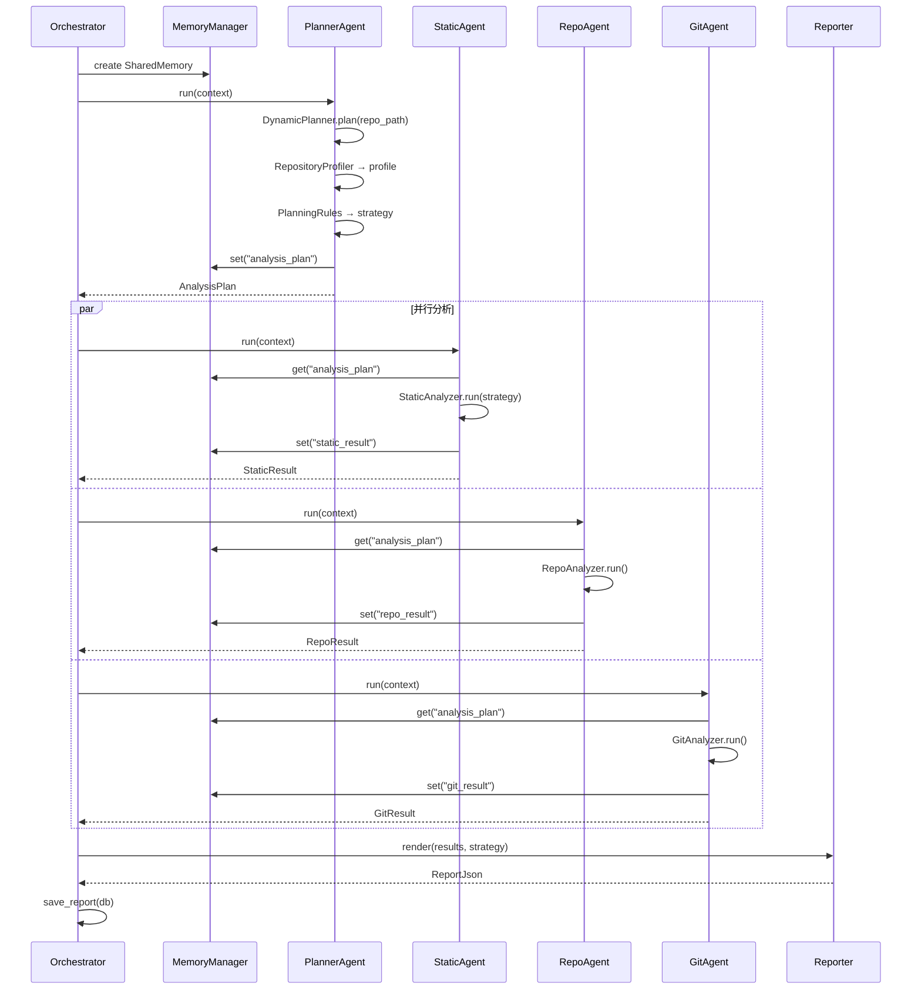

# Agent 协作流程/时序图

## 完整链路



## Planner → Analyzers 策略传递

```
PlannerAgent.run(ctx)
  └─ DynamicPlanner.plan(repo_path)
       └─ RepositoryProfiler.analyze()
            └─ {file_count: 1120, has_readme: true, ...}
       └─ PlanningRules.evaluate(profile)
            └─ AnalysisPlan(strategy=AnalysisStrategy(static="fast"))
       └─ memory.set("analysis_plan", plan)

StaticAgent.run(ctx)
  └─ memory.get("analysis_plan")
       └─ strategy.static → "fast"
  └─ StaticAnalyzer.run(repo_path, strategy_mode="fast")
       └─ 仅 radon cc，跳过 pylint
```

## Memory Key 约定

| Key | 写入方 | 读取方 | 内容 |
|-----|-------|-------|------|
| `analysis_plan` | PlannerAgent | Static/Repo/Git/Report Agent | AnalysisPlan(strategy) |
| `static_result` | StaticAgent | ReportAgent | StaticResult |
| `repo_result` | RepoAgent | ReportAgent | RepoResult |
| `git_result` | GitAgent | ReportAgent | GitResult |

## 错误处理

- 每个 Agent 独立超时，失败不阻塞其他 Agent
- `StaticResult.error` / `RepoResult.error` / `GitResult.error` 字段承载错误信息
- Reporter 优雅处理缺失的 `pylint_score`
- Planner 降级：超时或失败时使用默认 full 策略
