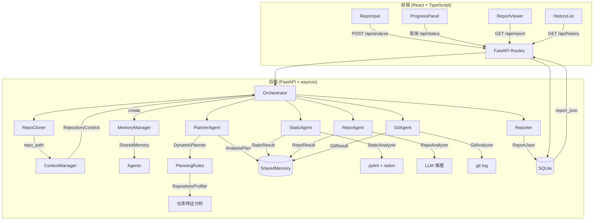

# RepoLens 系统架构总览

## 整体架构



## 核心模块

| 层 | 模块 | 职责 |
|----|------|------|
| API | `main.py` | FastAPI 路由，6 个端点 |
| 编排 | `orchestrator.py` | 管理流水线生命周期：克隆 → 分析 → 报告 |
| Agent | `agents/` | 7 个 Agent（Planner/Static/Repo/Git/Report + Registry） |
| 上下文 | `context/` | RepositoryContext 不可变分析上下文 |
| 记忆 | `memory/` | SharedMemory 线程安全 KV 共享存储 |
| 规划 | `planner/` | DynamicPlanner + PlanningRules 策略引擎 |
| 分析 | `analyzers/` | StaticAnalyzer/RepoAnalyzer/GitAnalyzer |
| 报告 | `reporter.py` | HTML 报告生成，健康评分，改进建议 |
| 持久化 | `db.py` | SQLite 存储（aiosqlite 异步） |

## 数据流

```
POST /api/analyze
  → Orchestrator.run_pipeline()
    → Clone repo
    → ContextManager.create() → RepositoryContext
    → MemoryManager.create()  → SharedMemory
    → PlannerAgent.run(ctx)   → AnalysisPlan(strategy)
    → StaticAgent.run(ctx)    → StaticResult
    → RepoAgent.run(ctx)      → RepoResult
    → GitAgent.run(ctx)       → GitResult
    → Reporter.render()       → ReportJson
    → save_report()           → SQLite
  → GET /api/report/{id}      → ReportJson
```

## 策略引擎

仓库规模决定 StaticAgent 的执行深度（所有 Agent 始终执行）：

| 文件数 | 策略 | 置信度 | 行为 |
|--------|------|--------|------|
| ≤ 500 | full | 100% | 完整 pylint + radon |
| 501-1000 | focused | 75% | 非测试文件 pylint + 全量 radon |
| > 1000 | fast | 50% | 仅 radon cc |
